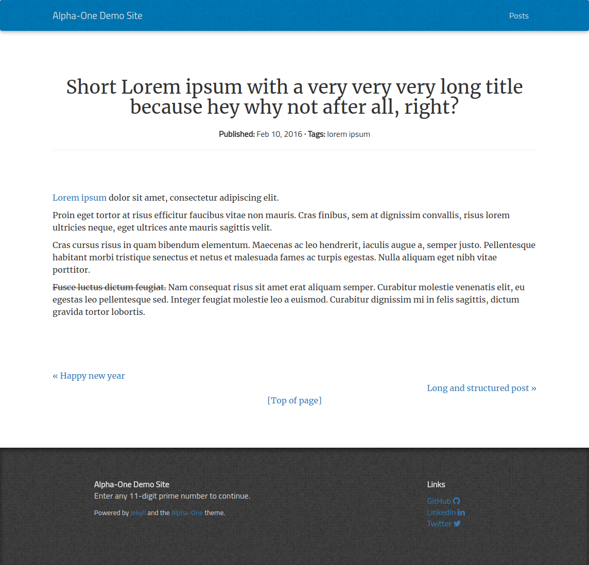

# Alpha-One

A Jekyll theme designed for enhanced readability of (long) blog posts.




## Features

- Responsive layout (based on Bootstrap 3)
- Social links
- Syntax highlighting with embedded pygments-css
- Gem-based (ie. easy updates!)

### Layouts

Alpha-One offers a `default` layout and a `post` layout. The `page` layout is a redirection to the `default` layout.

### TODO

- Tags listing page
- Categories listing page
- Google Analytics integration


## Installation

### For experienced users

Add to Gemfile:
```ruby
gem "alpha-one"
```

Add to _config.yml __
```yaml
theme: alpha-one
```

See the configuration section bellow for mandatory and extra settings.
Create an index.html file; you may wish to copy the one from the demo site to get started quickly.

### For Jekyll newcomers

See how to install Jekyll [on the official website](https://jekyllrb.com/docs/installation/).
Follow the [quick start guide](https://jekyllrb.com/docs/quickstart/)
Now you should be ready to follow the abode 'For experienced users' section ;)


## Configuration

The following variable can/must be set in `_config.yml`:
- title: text shown in the navbar and the footer
- motto: a maxim shown in the footer, under the title
- description: used by search engine
- author (optional): used to add a meta author in the header
- twitter_username (optional)
- github_username (optional)
- linkedin_username (optional)
- baseurl (optional): path to the root of your website; useful if it is hosted on a subpath
- png_favicon: name of the png file to be used as favicon; must reside bellow $baseurl
- header_link_1_label, header_link_1_href (both optional): used to add links in the navbar


## A note on table

To prettify your tables, use kramdown and add
`{: class="table table-striped"}`
right bellow the table in the markdown file


## About pagination

Pagination is not handled by the theme. See [Jekyll's doc page on pagination](https://jekyllrb.com/docs/pagination/).

## Contributing

Bug reports and pull requests are welcome on [GitHub](https://github.com/proudier/alpha-one).

## License

The theme is available as open source under the terms of the [MIT License](http://opensource.org/licenses/MIT).
